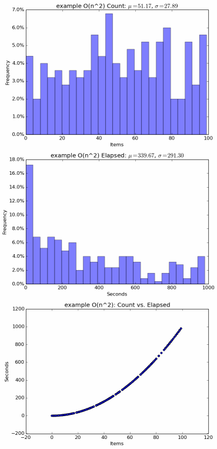

Data Output
===========

By default, metrics are printed to standard out. You can provide your own
metric recording funtion. It should take three arguments: ``count`` of items,
``elapsed`` time in seconds, and `name`, which can be None:

>>> def my_metric(name, count, elapsed):
...     print("Iterable %s produced %d items in %d milliseconds"%(name, count, int(round(elapsed*1000))))
...
>>> _ = measure_iter(math_is_hard(5), metric=my_metric, name="bogomips")
>>> list(_)
Iterable bogomips produced 5 items in 5000 milliseconds
[0, 1, 4, 9, 16]

Unless individually specified, metrics are reported using the global
:func:`.default_metric`. To change the active default, simply assign another
metric function to this attribute. In general, you should configure your
metric functions at program startup, **before** recording any metrics.
:func:`.make_multi_metric` creates a single metric function that records to
several outputs.

Comma Separated
---------------

:mod:`.csv` saves raw metrics as comma separated text files.
This is useful for conducting external analysis. :mod:`.csv` is threadsafe; use
under multiprocessing requires some care.

:class:`.CSVFileMetric` saves all metrics to a single file with three
columns: metric name, item count & elapsed time. Create an instance of this
class and pass its :meth:`.CSVFileMetric.metric` method to measurement
functions. The ``outfile`` parameter controls where to write data; an existing
file will be overwritten.

>>> from measure_it.csv import CSVFileMetric
>>> csvfm = CSVFileMetric("/tmp/my_metrics_file.csv")
>>> _ = measure_iter(math_is_hard(5), metric=csvfm.metric, name="bogomips")
>>> list(_)
[0, 1, 4, 9, 16]

:class:`.CSVDirMetric` saves metrics to multiple files, named after each
metric, with two columns: item count & elapsed time. This class is global to
your program; do not manually create instances. Instead, use the classmethod
:meth:`.CSVDirMetric.metric`. Set the class variable ``outdir`` to a directory
in which to store files. The contents of this directory will be deleted on
startup.

>>> from measure_it.csv import CSVDirMetric
>>> CSVDirMetric.outdir = "/tmp/my_metrics_dir"
>>> _ = measure_iter(math_is_hard(5), metric=CSVDirMetric.metric, name="bogomips")
>>> list(_)
[0, 1, 4, 9, 16]

Both classes support at ``dump_atexit`` flag, which will register a handler to
write data when the interpreter finishes execution. Set to false to manage
yourself.

Plots & Statistics
------------------

:mod:`.numpy` generates aggregate plots (graphs) and statistics. This is
useful for benchmarking or batch jobs; for live systems, `statsd (graphite)`_ is a
better choice. :mod:`.numpy` is threadsafe; use under multiprocessing
requires some care.

:class:`.NumpyMetric` subclasses are global to your program; do not manually
create instances. Instead, use the classmethod :meth:`.NumpyMetric.metric`.
The ``dump_atexit`` flag will register a handler to write data when the
interpreter finishes execution. Set to false to manage yourself.

>>> from measure_it.numpy import TableMetric, PlotMetric
>>> _ = measure_iter(math_is_hard(5), metric=TableMetric.metric, name="bogomips")
>>> list(_)
[0, 1, 4, 9, 16]

:class:`.TableMetric` prints pretty tables of aggregate population statistics. Set the class variable ``outfile`` to a file-like object (defaults to ``stderr``)::

    Name           Count Mean        Count Stddev        Elapsed Mean        Elapsed Stddev
    alice            47.96              28.44               310.85               291.16
    bob              50.08              28.84               333.98               297.11
    charles          51.79              29.22               353.58               300.82

:class:`.PlotMetric` generates plots using matplotlib. Plots are saved to
multiple files, named after each metric. Set the class variable ``outdir`` to a
directory in which to store files. The contents of this directory will be
deleted on startup.

    Sample plot for an O(n\ :sup:`2`\ ) algorithm

statsd (graphite)
-----------------

For monitoring production systems, the :func:`.statsd_metric` function can be
used to record metrics to `statsd <https://pypi.python.org/pypi/statsd>`__.
Each metric will generate two buckets: a count and a timing.
